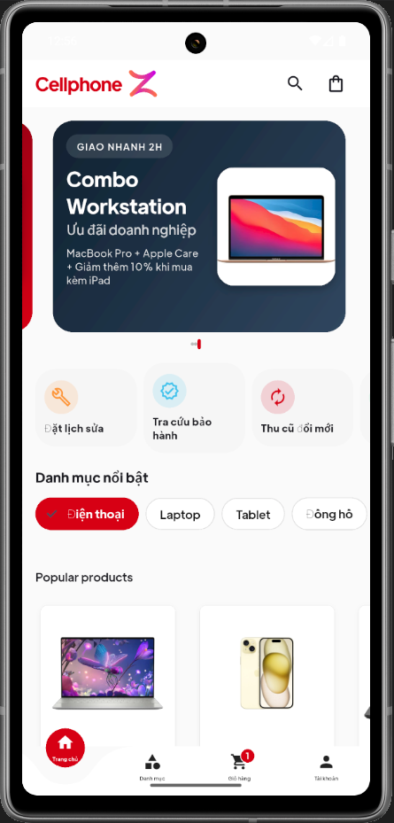
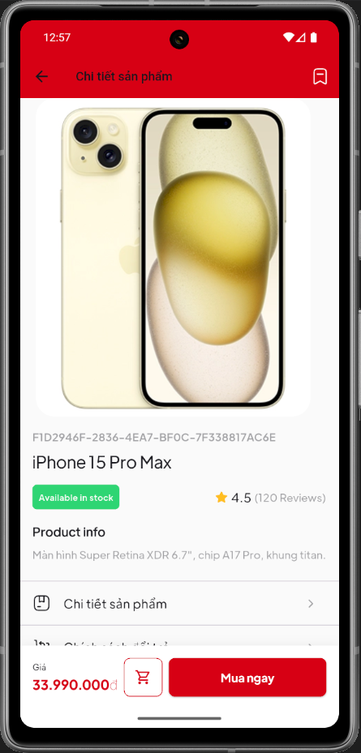
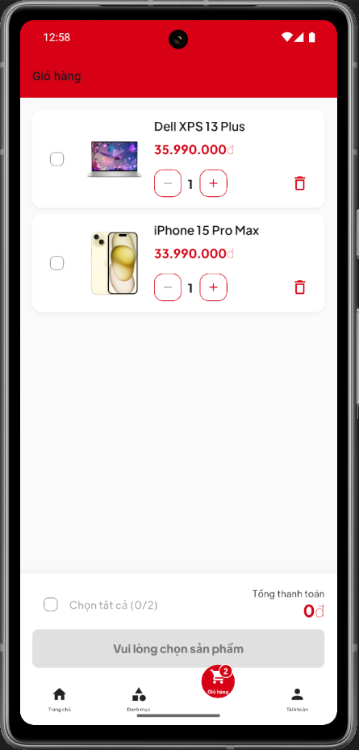
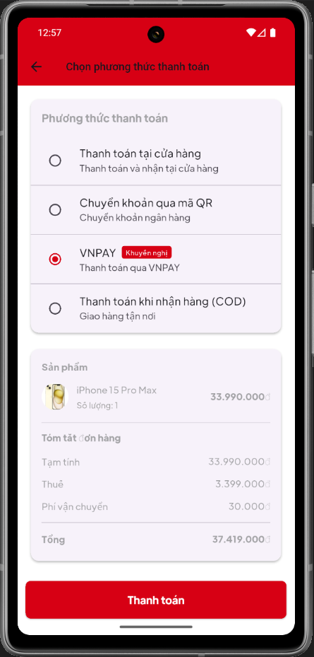
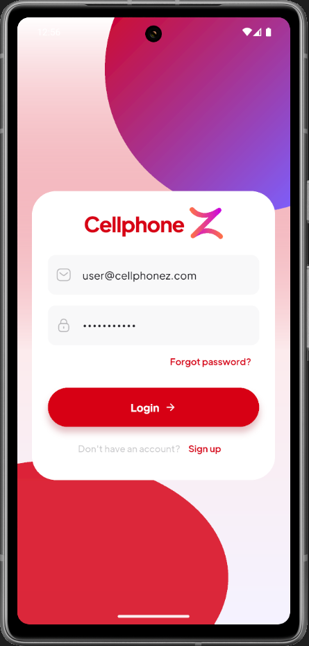
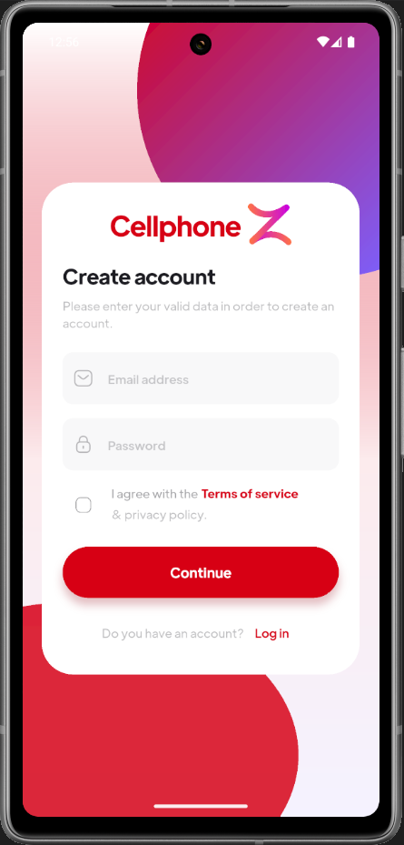
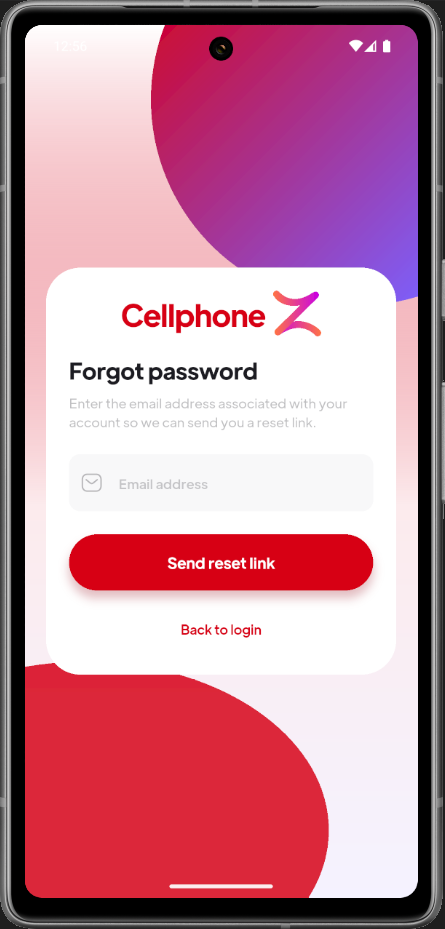
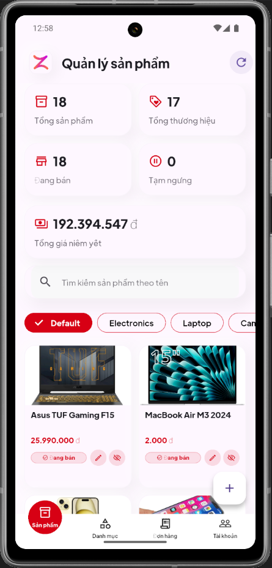
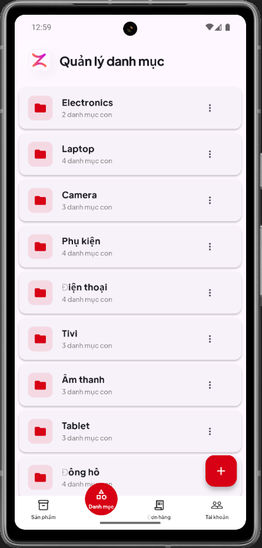
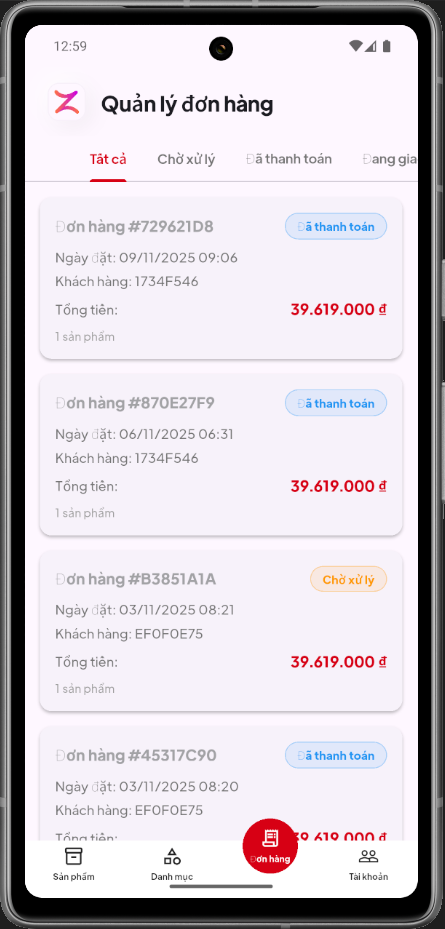

---
Responsive Flutter client for the CellphoneZ marketplace, enabling shoppers to browse consumer tech products, manage carts, and pay with COD or VNPay while admins curate the catalog, brands, and orders. The app targets both Android and iOS and is backed by Supabase services plus build_runner tooling.

| Home | Product Detail | Cart | Payment |
| --- | --- | --- | --- |
|  |  |  |  |

| Login | Sign Up | Forgot Password |
| --- | --- | --- |
|  |  |  |

| Admin Products | Admin Categories | Admin Orders |
| --- | --- | --- |
|  |  |  |

## Table of Contents
- [](#)
- [Table of Contents](#table-of-contents)
- [Overview](#overview)
- [Feature Highlights](#feature-highlights)
  - [Customer Journey](#customer-journey)
  - [Admin Workspace](#admin-workspace)
- [Architecture \& Tech Stack](#architecture--tech-stack)
- [Project Layout](#project-layout)
- [Getting Started](#getting-started)
  - [Prerequisites](#prerequisites)
  - [Setup](#setup)
- [Recommended Workflows](#recommended-workflows)
- [Testing](#testing)
- [Schema \& Environment Notes](#schema--environment-notes)

## Overview
- **Goal:** Deliver an end-to-end shopping journey for smartphones, laptops, tablets, and accessories with admin oversight.
- **Target users:** Customers who discover and purchase devices, and administrators who manage inventory, brands, and fulfillment.
- **State management:** Mix of `bloc`/`flutter_bloc` for flows, `provider` for lightweight shared state, and `get_it` for dependency injection.
- **Back end:** Supabase (PostgreSQL + Auth + Storage) with generated clients sourced from `supabase_schema.sql` / `SCHEMA_GUIDE.md`.
- **Payment:** Cash on Delivery and VNPay via the `vnpay_flutter` and `webview_flutter` packages.

## Feature Highlights
### Customer Journey
- **Onboarding:** Email or phone sign-up/login flows with validation, forgot-password, and persistent sessions.
- **Catalog exploration:** Category drill-down (phones, laptops, tablets, accessories), keyword search, brand filters, and detailed spec pages with cached images.
- **Cart & checkout:** Add/update/remove items, automatic subtotals, shipping address selection, and dual payment choices (COD or VNPay).
- **Order tracking:** Timeline of orders with states such as processing, delivering, delivered, and cancelled; drill into pricing, logistics, and timestamps.
- **Account management:** Purchase history, profile overview, and secure sign-out.

### Admin Workspace
- **Products:** Create, edit, or retire products with titles, descriptions, photos, prices, inventory, and assigned categories.
- **Categories & brands:** Maintain taxonomies (e.g., Laptop, Phone) and brand catalogs (Apple, Samsung, Asus, etc.).
- **Orders:** Monitor all orders (new, shipping, completed, cancelled) and update fulfillment statuses.

## Architecture & Tech Stack
- **Framework:** Flutter (Dart SDK `>=3.2.0 <4.0.0`), Material Design, custom `Plus Jakarta` and `Grandis Extended` fonts.
- **State & DI:** `bloc`, `flutter_bloc`, `provider`, `get_it`, `equatable`.
- **Data & Services:** `supabase_flutter`, `freezed` + `json_serializable`, `build_runner`, `logger`, `http`, `shared_preferences`.
- **Maps & location:** `google_maps_flutter`, `geolocator`, `geocoding` for delivery address workflows.
- **Media & UI:** `cached_network_image`, `image_picker`, `flutter_svg`, `animations`, `curved_navigation_bar`.
- **Payments:** `vnpay_flutter` + `webview_flutter` for VNPay, COD handled in-app.

## Project Layout
```text
├── lib/
│   ├── admin/             # Admin dashboards and widgets
│   ├── components/        # Reusable UI building blocks
│   ├── providers/         # Provider-based state holders
│   ├── screens/           # Feature screens per flow
│   └── services/          # Integrations (Supabase, payments, etc.)
├── assets/                # Icons, images, fonts, and illustrations
├── docs/
│   ├── assets/            # Screenshot references used in this README
│   └── …                  # Additional documentation
├── android/ , ios/        # Platform scaffolding
├── supabase_schema.sql    # Source of truth for DB schema
├── SCHEMA_GUIDE.md        # Schema documentation and conventions
├── PRM392_CellPhoneZ.md   # Vietnamese requirement specification
├── melos.yaml / gen.sh    # Build_runner & workspace tooling
└── README.md              # You are here
```

## Getting Started
### Prerequisites
- Flutter SDK 3.2+ with Dart 3.
- Xcode (iOS) / Android SDK (Android) and device/emulator setup.
- Melos (`dart pub global activate melos`) for workspace orchestration.
- Supabase project + credentials, VNPay sandbox keys.

### Setup
1. Install dependencies: `flutter pub get`.
2. Copy `.env` from the secure vault, populate Supabase URL/anon keys, VNPay credentials, and any Google Maps keys (never commit secrets).
3. Generate code when models or schema change: `melos run gen`.
4. Start a dev session with hot reload: `melos run run`.
5. Build a release APK when ready: `melos run build-apk`.

## Recommended Workflows
- **Analyzer & formatting:** `melos run analyze` and `melos run format` (two-space indentation enforced by `analysis_options.yaml` / `flutter_lints`).
- **Cleaning stale artifacts:** `melos run clean` before switching branches or when generated code drifts.
- **Assets & naming:** Use `snake_case` for asset filenames, `UpperCamelCase` for types, and group feature-specific widgets under `lib/screens/<feature>/`.
- **CI-friendly steps:** Run `melos run test`, `melos run analyze`, and `melos run build-apk` locally before opening a PR.
- **Commits:** Follow Conventional Commits (e.g., `feat: add VNPay checkout`). Keep subject lines `<72` chars and mention ticket IDs when relevant.

## Testing
- Place widget/unit tests under `test/` using `<feature>_test.dart` naming, e.g., `cart_summary_test.dart`.
- Execute the full suite via `melos run test`.
- Add golden references for UI snapshots in `test/goldens/` and keep descriptive filenames (e.g., `home_grid_dark.png`).
- Extend coverage whenever you introduce new flows (checkout, admin management, etc.) or modify service integrations.

## Schema & Environment Notes
- Update `supabase_schema.sql` plus `SCHEMA_GUIDE.md` whenever the data model changes.
- After schema edits, run `melos run gen` to refresh generated clients/Freezed models.
- Document migrations under `docs/` and coordinate Supabase migrations with backend teammates.
- Keep `.env` and other secrets out of source control; leverage the secure vault when sharing configs.

---
Need clarifications or more screenshots? Check `docs/assets/` for the full catalog or open an issue/PR describing the additions. Happy shipping!